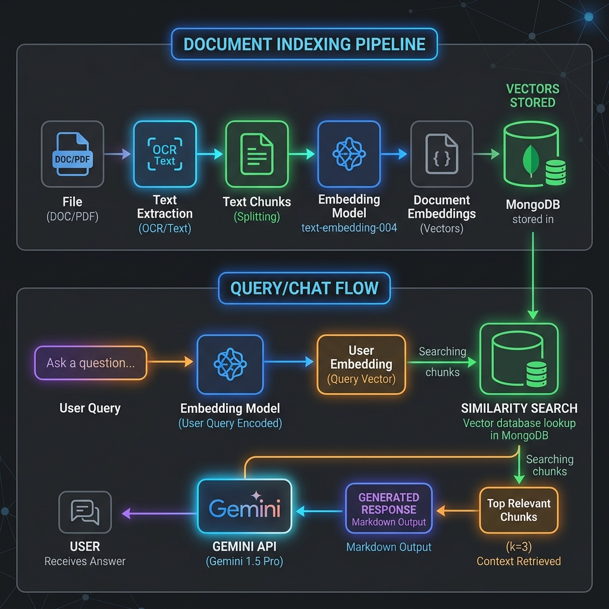

# 🧠 Hướng dẫn Kiến trúc RAG Pipeline — SE1939 RAG Chatbot

Tài liệu này giải thích chi tiết nguyên lý hoạt động, kiến trúc hệ thống và quy trình xử lý dữ liệu của RAG (Retrieval-Augmented Generation) Pipeline được triển khai trong dự án **SE1939 RAG Chatbot** (Software Modeling and Design). 

Tài liệu này được biên soạn nhằm phục vụ công tác báo cáo, thuyết trình và bảo vệ đồ án trước hội đồng môn học.

---

## 📊 1. Sơ đồ kiến trúc RAG Pipeline

Hệ thống hoạt động dựa trên hai quy trình chính chạy độc lập: **Quy trình Indexing tài liệu** (Nạp dữ liệu) và **Quy trình Chat & Hỏi đáp** (Truy vấn dữ liệu).



---

## 2. Các khái niệm cốt lõi trong RAG

Để hiểu cách RAG hoạt động, ta cần làm quen với hai khái niệm cơ bản: **Chunking (Phân đoạn)** và **Embedding (Vector hóa)**.

### A. Chunks (Đoạn cắt nhỏ)
* **Khái niệm**: Là quá trình chia nhỏ một tài liệu lớn (sách giáo trình, bài giảng dài hàng trăm trang) thành các đoạn văn ngắn liên tiếp nhau.
* **Cấu hình hệ thống**:
  * **Kích thước chunk (Chunk Size)**: `800 tokens` (xấp xỉ ~3200 ký tự tiếng Anh).
  * **Độ chồng lấn (Chunk Overlap)**: `200 tokens` (xấp xỉ ~800 ký tự).
* **Tại sao cần Overlap?** 
  > [!NOTE]
  > Việc chồng lấn giữa 2 chunk liền kề (ví dụ: chunk 2 chứa 200 tokens cuối của chunk 1) giúp bảo toàn tính toàn vẹn của ngữ cảnh. Tránh trường hợp một câu định nghĩa hoặc một ý quan trọng bị cắt đôi ngay ranh giới phân tách chunk, khiến AI không hiểu trọn vẹn ý nghĩa.

### B. Embeddings (Vector biểu diễn ngữ nghĩa)
* **Khái niệm**: Là một kỹ thuật học máy biến đổi một đoạn chữ thành một **chuỗi số thực (Vector)** có kích thước cố định trong không gian đa chiều (Gemini API trả về vector **768 chiều**).
* **Nguyên lý hoạt động**:
  * Các từ ngữ hoặc đoạn văn có **ngữ nghĩa tương tự** sẽ được ánh xạ thành các vector nằm **gần nhau** trong không gian toán học.
  * *Ví dụ*: Vector của cụm *"Strategy Pattern"* và *"Design Pattern"* sẽ có khoảng cách toán học cực kỳ gần nhau, trong khi vector của *"Unified Process"* và *"Cooking Recipe"* sẽ rất xa nhau.

---

## 3. Chi tiết Quy trình 1: Indexing Tài liệu (Nạp dữ liệu)

Quy trình này diễn ra khi giảng viên hoặc sinh viên tải lên một tài liệu học tập mới.

```
[Upload File] ➔ [Trích xuất Văn bản] ➔ [Chia nhỏ Chunks] ➔ [Gọi Gemini Embeddings] ➔ [Lưu vào MongoDB]
```

### Bước 1: Trích xuất văn bản thô (Parsing)
Hệ thống sử dụng [documentParserService.ts](file:///Users/FPTU/Ki%207/SWD/ProjectBaseLearning/se1939-rag-chatbot/backend/src/services/documentParserService.ts) để đọc tệp tin tùy theo định dạng:
* **PDF**: Sử dụng thư viện `pdf-parse` để duyệt qua từng trang và trích xuất chuỗi văn bản.
* **Word (DOCX)**: Sử dụng thư viện `mammoth` trích xuất văn bản thô không định dạng để giữ độ sạch của chữ.
* **PowerPoint (PPTX)**: Sử dụng thư viện `officeparser` quét qua các slide bài giảng.

### Bước 2: Chia nhỏ và xử lý thông minh (Chunking)
Hệ thống sử dụng [chunkingService.ts](file:///Users/FPTU/Ki%207/SWD/ProjectBaseLearning/se1939-rag-chatbot/backend/src/services/chunkingService.ts) để phân đoạn:
* Không cắt ngẫu nhiên theo số ký tự.
* Hệ thống duyệt tìm các ranh giới tự nhiên gần nhất (xuống dòng kép `\n\n`, dấu chấm câu `. `, `! `, `? `) để thực hiện vết cắt, đảm bảo thông tin của mỗi chunk kết thúc trọn vẹn ngữ pháp.
* Tích hợp lưu vết **số trang gốc (Page Numbers)** để sau này làm căn cứ trích dẫn nguồn.

### Bước 3: Tạo vector đặc trưng (Embedding generation)
Hệ thống gửi danh sách văn bản của các chunks sang **Gemini API** qua endpoint:
`POST https://generativelanguage.googleapis.com/v1beta/models/gemini-embedding-001:embedContent`
* **Input**: Mảng nội dung chữ của các chunks.
* **Output**: Mảng các vector 768 chiều biểu thị ý nghĩa sinh học của văn bản.

### Bước 4: Lưu trữ cơ sở dữ liệu
Lưu trữ đồng thời:
1. Thông tin văn bản gốc của chunk.
2. Metadata: tên file, số chương, tên chương, số trang.
3. Mảng Vector Embedding.

---

## 4. Chi tiết Quy trình 2: Chat & Hỏi đáp (Truy vấn dữ liệu)

Diễn ra theo thời gian thực khi sinh viên đặt câu hỏi trên giao diện Chat.

```
[Nhận câu hỏi] ➔ [Tạo Vector Câu hỏi] ➔ [Tra cứu Cosine Similarity] ➔ [Gộp Ngữ cảnh] ➔ [Gemini Flash trả lời]
```

### Bước 1: Vector hóa câu hỏi
* Biến câu hỏi đầu vào của người dùng thành một **Vector câu hỏi (Query Vector)** bằng mô hình `gemini-embedding-001`.

### Bước 2: Truy tìm tài liệu liên quan nhất (Retrieval)
Hệ thống sử dụng [retrievalService.ts](file:///Users/FPTU/Ki%207/SWD/ProjectBaseLearning/se1939-rag-chatbot/backend/src/services/retrievalService.ts):
* Vì dùng MongoDB Atlas gói miễn phí (không hỗ trợ chỉ mục Search Vector gốc), hệ thống thực hiện thuật toán **Cosine Similarity** trực tiếp trong RAM.
* Công thức tính góc giữa Vector câu hỏi ($A$) và Vector chunk ($B$):
$$\text{Similarity}(A, B) = \frac{A \cdot B}{\|A\| \|B\|}$$
* Điểm số nằm trong khoảng $[-1, 1]$. Điểm càng gần $1.0$, độ tương đồng ngữ nghĩa càng cao.
* Hệ thống lọc lấy các chunks có điểm $\ge 0.6$ và sắp xếp lấy **Top 3** chunks tốt nhất.

### Bước 3: Tổ hợp prompt sinh câu trả lời (Generation)
Hệ thống tập hợp các chunks tìm được thành một đoạn văn bản ngữ cảnh (Context) và gửi yêu cầu tới mô hình `gemini-2.5-flash` qua hàm `callGemini` trong [chatService.ts](file:///Users/FPTU/Ki%207/SWD/ProjectBaseLearning/se1939-rag-chatbot/backend/src/services/chatService.ts):

```text
Bạn là Trợ lý Học tập môn SE1939. Hãy trả lời câu hỏi dựa trên ngữ cảnh dưới đây:
===
[Source 1] Chapter 2 — Page 12: The Unified Process features 4 phases: Inception...
[Source 2] ...
===
Nếu ngữ cảnh không chứa thông tin phù hợp, hãy thông báo lịch sự từ chối trả lời ngoài phạm vi học tập.

Câu hỏi: Các phase của Unified Process là gì?
```

### Bước 4: Trích dẫn nguồn (Citations)
* Từ dữ liệu Top 3 chunks tìm được, hệ thống trích xuất tên tài liệu, số trang, số chương để tạo danh sách **Citations** đính kèm dưới câu trả lời.
* Sinh viên có thể click vào số trích dẫn `[1]`, `[2]` để cuộn ngay đến phần trích nguồn tương ứng dưới giao diện, tăng tính minh bạch học thuật.

---

## 💡 Ưu điểm nổi bật của kiến trúc này khi báo cáo/demo

1. **Local Cosine Search**: Không phụ thuộc vào gói trả phí của MongoDB Atlas, chạy tìm kiếm vector trực tiếp trên RAM siêu tốc và ổn định cho tập dữ liệu môn học.
2. **Context-Aware Memory**: Giữ lịch sử 6 tin nhắn gần nhất giúp cuộc hội thoại diễn ra tự nhiên theo ngữ cảnh liên tiếp.
3. **Strict Boundaries**: Giới hạn câu trả lời trong phạm vi giáo trình FLM môn Software Modeling & Design giúp loại bỏ hiện tượng "ảo giác" (hallucination) của AI lớn, trả lời chuẩn xác thuật ngữ chuyên ngành.
