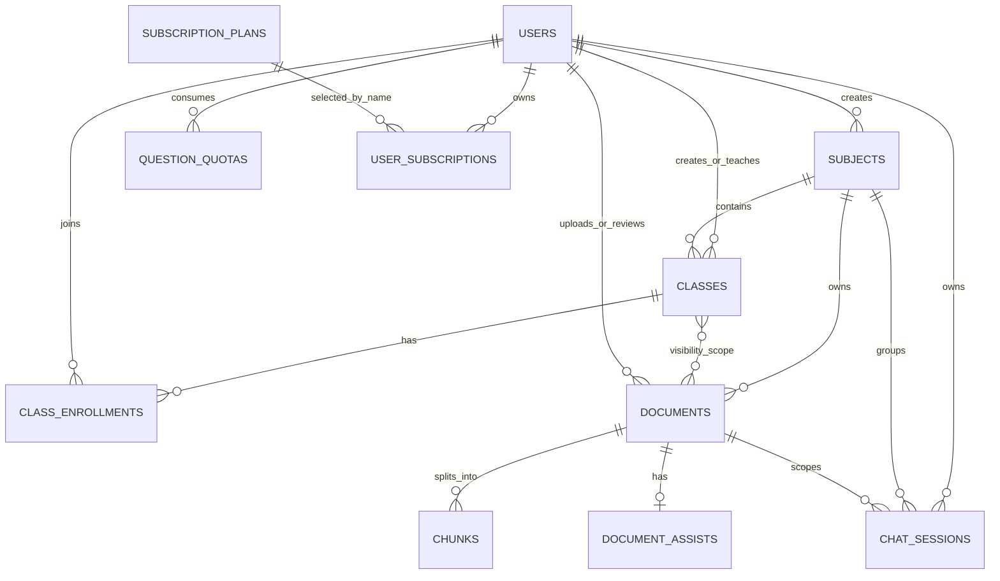

# Smart RAG Learning Platform - ERD v3

File sơ đồ chính: [`erd.drawio`](./erd.drawio)

## 1. Phạm vi

ERD này phản ánh data model hiện tại sau khi bổ sung vai trò admin, enrollment theo lớp, class-aware document privacy, quy trình duyệt và quota user theo tháng.

Dự án dùng MongoDB và Mongoose. Vì vậy, sơ đồ thể hiện:

- Collection và `ObjectId` reference.
- Unique index và compound unique index.
- Embedded subdocument như message, citation, takeaway và flashcard.
- Quan hệ logic bằng business key, cụ thể là `usersubscriptions.planName` nối với `subscriptionplans.name`.

Tên trên sơ đồ là tên collection thực tế của Mongoose. Tên model được ghi trong ngoặc ở các collection có tên khó đọc, ví dụ `classenrollments (ClassEnrollment)`.

## 2. Thay đổi so với ERD cũ

| Trước đây | Phiên bản hiện tại |
| --- | --- |
| Chỉ có role `teacher`, `student` | Có `admin`, `teacher`, `student` |
| Student lưu `enrolledSubjects[]` trong user | Enrollment được chuẩn hóa qua `classes` và `classenrollments` |
| Teacher tạo subject và giữ `Subject.teacherId` | Admin tạo subject; teacher được phân công ở `classes.teacherId` |
| Subject có password đã hash | Class có `joinCode` plaintext, random 8 ký tự |
| Document kết thúc ở trạng thái `indexed` | Document phải đi qua `pending`, sau đó admin `approved` hoặc `rejected` |
| Subscription có `pending` và `approvedBy` | Demo mode kích hoạt ngay; chỉ còn `active`, `expired`, `cancelled` |
| Quyền subject lấy từ user | Quyền student lấy từ active enrollment; quyền teacher lấy từ active class assignment |

## 3. Sơ đồ quan hệ rút gọn



## 4. Ký hiệu

| Ký hiệu | Ý nghĩa |
| --- | --- |
| `PK` | Primary key của collection. |
| `FK` | `ObjectId` reference sang collection khác. |
| `FK*` | Reference logic qua business key, không phải `ObjectId`. |
| `UQ` | Unique index. |
| `?` | Optional hoặc có thể `null`. |
| `[]` | Array hoặc embedded subdocument array. |
| Đường nét đứt | Optional reference như `teacherId` hoặc `reviewedBy`. |

## 5. Identity và Academic Access

### 5.1. `users`

Lưu toàn bộ tài khoản admin, teacher và student.

| Field | Ghi chú |
| --- | --- |
| `username`, `email`, `userCode` | Unique; dùng để đăng nhập hoặc định danh hồ sơ. |
| `password` | Được hash bằng bcrypt trước khi lưu. |
| `role` | Immutable sau khi tạo: `admin`, `teacher`, `student`. |
| `isActive`, `deactivatedAt` | Phục vụ soft deactivate tài khoản. |

`users` không còn chứa `enrolledSubjects[]`.

### 5.2. `subjects`

Subject là môn học dùng chung cho nhiều lớp.

| Field | Ghi chú |
| --- | --- |
| `code`, `name` | Unique; `code` được chuẩn hóa uppercase. |
| `createdBy` | Admin tạo subject. |
| `isActive` | Subject bị archive sẽ không cấp quyền truy cập mới. |

Subject không còn `password` và không còn teacher sở hữu trực tiếp.

### 5.3. `classes`

Class là đơn vị admin dùng để phân công teacher và quản lý roster.

| Field | Ghi chú |
| --- | --- |
| `subjectId` | Mỗi class thuộc đúng một subject. |
| `teacherId` | Optional khi class còn `draft`; class `active` bắt buộc có teacher. |
| `status` | `draft`, `active`, `archived`. |
| `joinCode` | Unique, plaintext, 8 ký tự chữ/số để chia sẻ cho student. |
| `allowSelfEnrollment` | Cho phép student tự join bằng code. |
| `createdBy` | Admin tạo class. |

Một teacher có thể phụ trách nhiều class. Document luôn thuộc một subject và có thêm phạm vi hiển thị: dùng chung toàn môn hoặc giới hạn cho một hay nhiều class cụ thể.

### 5.4. `classenrollments`

Collection trung gian cho quan hệ nhiều-nhiều giữa student và class.

| Field | Ghi chú |
| --- | --- |
| `classId`, `studentId` | Compound unique, ngăn một student bị thêm trùng vào cùng class. |
| `source` | `admin` nếu được admin thêm; `self` nếu tự join. |
| `status` | `active` hoặc `removed`. |
| `removedAt` | Soft removal, giữ lịch sử roster. |

Quyền subject của student tồn tại khi có ít nhất một `ClassEnrollment.status = active` nối tới một `Class.status = active` của subject đó.

## 6. Document Pipeline và Review

### 6.1. `documents`

Metadata của file giáo viên upload.

| Nhóm field | Ghi chú |
| --- | --- |
| File | `fileName`, `originalName`, `fileType`, `fileSize`, `mimeType`. |
| Subject snapshot | `subjectId` là khóa authorization; `subject` là tên snapshot để hiển thị/citation. |
| Phạm vi | `visibility = subject-wide` thì `classIds = []`; `visibility = class-restricted` thì `classIds` phải chứa ít nhất một lớp active cùng subject do uploader phụ trách. |
| Nội dung | `chapter`, `chapterTitle`, `totalChunks`, `totalPages`. |
| Người xử lý | `uploadedBy` là teacher; `reviewedBy` là admin và chỉ có sau review. |
| Audit | `uploadedAt`, `processedAt`, `indexedAt`, `reviewedAt`. |
| Kết quả lỗi | `errorMessage`, `rejectionReason`. |

Document lifecycle:

```text
uploaded -> processing -> pending -> approved
                          |       -> rejected
                          -> failed (khi parse/embed lỗi)
```

Quy tắc chính:

- Student chỉ đọc/chat tài liệu `approved`. Với `subject-wide`, cần enrollment active trong một lớp active của subject; với `class-restricted`, enrollment phải thuộc ít nhất một class trong `classIds`.
- Teacher đọc tài liệu `subject-wide` trong subject được phân công, tài liệu `class-restricted` của lớp mình phụ trách và mọi tài liệu do chính mình upload.
- Admin xem toàn bộ và là role duy nhất approve/reject.
- Reject giữ file vật lý và document metadata, nhưng xóa chunks, assist và chat session liên quan; quota tháng của user không bị thay đổi.
- Khi enrollment/class assignment không còn active, lịch sử chat của tài liệu restricted cũng không còn đọc được.

### 6.2. `chunks`

Mỗi document được parse, chia thành nhiều chunk và tạo embedding.

- `documentId` là reference authorization và retrieval chính.
- `embedding[]` phục vụ semantic search.
- `metadata.subject`, `chapter`, `chapterTitle`, `fileName` là display snapshot.
- RAG luôn filter theo `documentId`; không dùng tên subject để cấp quyền.
- LLM chỉ dùng context từ các chunks này; không có kết quả đạt threshold thì trả refusal message, không fallback sang kiến thức chung.

### 6.3. `documentassists`

Cache Study Assist gồm `takeaways[]` và `flashcards[]`.

`documentId` unique nên một document có tối đa một assist record. Teacher uploader có thể generate khi document `pending` hoặc `approved`; student chỉ đọc sau khi document được approve.

## 7. Chat và Quota

### 7.1. `chatsessions`

Chat tiếp tục scoped theo document, không thêm `classId`.

| Field | Ghi chú |
| --- | --- |
| `userId` | Chủ sở hữu chat session. |
| `subjectId` | Hỗ trợ group/filter theo subject. |
| `documentId` | Document duy nhất được dùng để retrieval. |
| `messages[]` | Embedded message; assistant message có thể chứa `citations[]`. |

Quyền document và class được kiểm tra lại khi tạo session, liệt kê/mở lịch sử và mỗi lần gửi message.

### 7.2. `questionquotas`

Quota tính trên tổng số câu hỏi của user trong một tháng UTC, không phụ thuộc subject, class, document hoặc cách giảng viên chia file.

| Constraint | Ý nghĩa |
| --- | --- |
| `UQ userId + periodKey` | Mỗi user có tối đa một quota record cho mỗi tháng (`YYYY-MM`). |
| `periodStart`, `periodEnd` | Biên tháng UTC dạng nửa mở: `[periodStart, periodEnd)`. |

Giới hạn hiện tại:

| Plan | Câu hỏi / tháng |
| --- | ---: |
| Free | 50 |
| Plus | 300 |
| Pro | 1000 |

Đổi gói giữa tháng không reset `questionCount`; chỉ thay đổi limit hiệu lực. Mỗi request của student reserve quota bằng cập nhật nguyên tử trước khi chạy AI và được hoàn lại nếu pipeline thất bại. Vì vậy gửi request song song không thể vượt limit.

## 8. Subscription Demo

### 8.1. `subscriptionplans`

Lưu cấu hình plan `free`, `plus`, `pro`, bao gồm giá, hạn mức, thời hạn và danh sách tính năng.

### 8.2. `usersubscriptions`

Lưu lịch sử plan của user.

| Field | Ghi chú |
| --- | --- |
| `userId` | Chủ subscription. |
| `planName` | Business key trỏ logic tới `subscriptionplans.name`. |
| `status` | `active`, `expired`, `cancelled`. Không còn `pending`. |
| `paymentMethod` | `demo` trong luồng hiện tại; không có payment gateway. |

Plus/Pro được active ngay sau khi student chọn plan. Không còn `approvedBy` và không còn quy trình admin duyệt subscription.

## 9. Ma trận quan hệ

| Parent | Child | Field | Bội số |
| --- | --- | --- | --- |
| `users` | `subjects` | `createdBy` | 1 - N |
| `users` | `classes` | `createdBy`, `teacherId?` | 1 - N |
| `subjects` | `classes` | `subjectId` | 1 - N |
| `classes` | `classenrollments` | `classId` | 1 - N |
| `users` | `classenrollments` | `studentId` | 1 - N |
| `subjects` | `documents` | `subjectId` | 1 - N |
| `classes` | `documents` | `classIds[]` | N - N optional |
| `users` | `documents` | `uploadedBy`, `reviewedBy?` | 1 - N |
| `documents` | `chunks` | `documentId` | 1 - N |
| `documents` | `documentassists` | `documentId` unique | 1 - 0..1 |
| `users` | `chatsessions` | `userId` | 1 - N |
| `subjects` | `chatsessions` | `subjectId` | 1 - N |
| `documents` | `chatsessions` | `documentId` | 1 - N |
| `users` | `questionquotas` | `userId` | 1 - N |
| `users` | `usersubscriptions` | `userId` | 1 - N |
| `subscriptionplans` | `usersubscriptions` | `name` -> `planName` | 1 - N logic |

## 10. Các invariant quan trọng

1. Role của user không được sửa sau khi tạo.
2. Class `active` phải có một active teacher.
3. `Subject.code`, `Class.code`, `Class.joinCode`, username, email và userCode là unique.
4. Student enrollment và teacher assignment chỉ cấp quyền khi class và subject còn active.
5. Authorization dùng `ObjectId`; các string snapshot chỉ phục vụ hiển thị/citation.
6. Chat retrieval luôn scoped theo `documentId`; quota scoped theo `userId + periodKey`.
7. `class-restricted` bắt buộc có ít nhất một class cùng subject và uploader phải đang phụ trách class đó tại thời điểm upload.
8. Mọi thao tác document, kể cả file/chunks/assist và chat history, đều kiểm tra lại visibility theo enrollment/assignment hiện tại.
9. Đổi gói không reset quota trong tháng.
10. Rejected document không được gửi duyệt lại; teacher phải upload document record mới.
