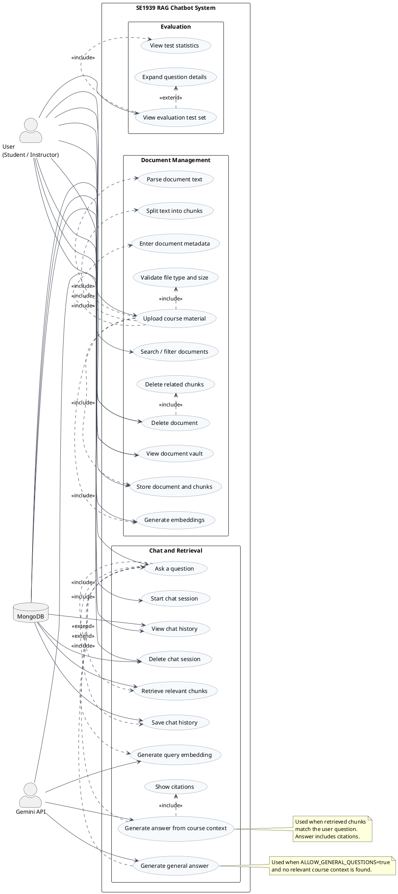

# Use Case Diagram - SE1939 RAG Chatbot

This diagram describes the main behavior of the SE1939 RAG Chatbot system. The project is a single-user academic demo, so the primary human actor is modeled as `User (Student / Instructor)`.

## Actors

| Actor | Description |
| --- | --- |
| User (Student / Instructor) | Uploads course documents, asks questions, manages chat sessions, and views the evaluation test set. |
| Gemini API | Generates embeddings and natural-language answers. |
| MongoDB | Stores documents, chunks, embeddings, chat sessions, messages, and citations. |

## Main Use Cases

| Group | Use Case | Description |
| --- | --- | --- |
| Document Management | Upload course material | User uploads PDF, DOCX, or PPTX materials with subject/chapter metadata. |
| Document Management | Parse document text | System extracts text from uploaded files. |
| Document Management | Split text into chunks | System divides extracted text into searchable chunks. |
| Document Management | Generate embeddings | System calls Gemini embedding model for each chunk. |
| Document Management | Store document and chunks | System stores metadata, chunks, and embeddings in MongoDB. |
| Document Management | View/Search/Delete documents | User manages indexed materials in the document vault. |
| Chat and Retrieval | Start chat session | User begins a new conversation. |
| Chat and Retrieval | Ask a question | User sends a natural-language question. |
| Chat and Retrieval | Retrieve relevant chunks | System embeds the query and runs cosine similarity search over MongoDB chunks. |
| Chat and Retrieval | Generate answer from course context | Gemini answers using retrieved context and citations. |
| Chat and Retrieval | Generate general answer | Gemini answers from general knowledge when no context is found and `ALLOW_GENERAL_QUESTIONS=true`. |
| Chat and Retrieval | Save/View/Delete chat history | System stores and manages sessions/messages in MongoDB. |
| Evaluation | View evaluation test set | User views benchmark questions from `test-set.json`. |
| Evaluation | View test statistics | System shows summary stats by chapter/category/difficulty. |
| Evaluation | Expand question details | User opens full question, ground-truth answer, keywords, and source. |

## PlantUML Source

The editable PlantUML file is here:

[`docs/use-case-diagram.puml`](./use-case-diagram.puml)

