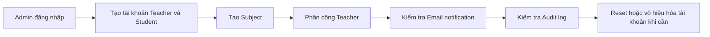
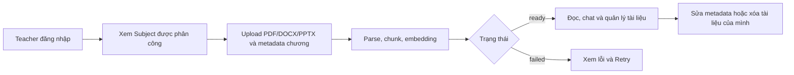
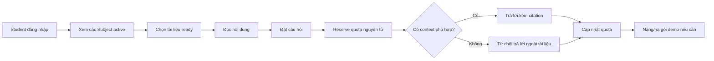

# Web Test Plan - EduSmart RAG Learning Platform

## 1. Mục tiêu và phạm vi

Test plan này kiểm tra web theo domain hiện tại của source code: `Subject-only`, gồm ba vai trò `admin`, `teacher`, `student`.

Phạm vi chính:

- Đăng nhập, đăng xuất, phân quyền route và thu hồi phiên khi tài khoản bị vô hiệu hóa.
- Admin quản lý tài khoản, môn học, phân công giảng viên, email notification và audit log.
- Teacher upload/quản lý tài liệu thuộc môn được phân công.
- Student đọc tài liệu sẵn sàng, hỏi đáp RAG, citation, quota và gói dịch vụ demo.

Ngoài phạm vi hiện tại:

- Đăng ký tài khoản công khai.
- Class, roster, join code, enrollment và mật khẩu môn học.
- Thanh toán thật.
- Duyệt/reject tài liệu; tài liệu được công bố khi xử lý thành công.

## 2. Môi trường và điều kiện bắt đầu

| Hạng mục | Giá trị/điều kiện |
|---|---|
| Frontend | `http://localhost:5173` |
| Backend | `http://localhost:3001` |
| Health check | `GET /api/health` trả `200`, `status=ok` |
| Database | MongoDB kết nối thành công và đã chạy seed plan |
| AI | Gemini key hợp lệ để test embedding và chat |
| Email | SMTP test hoặc email sandbox; ghi rõ enabled/disabled |
| Trình duyệt | Chrome bản hiện hành; thêm viewport mobile 390x844 |
| File test | 1 PDF đúng, 1 DOCX đúng, 1 PPTX đúng, 1 file giả đuôi, 1 file vượt giới hạn |

Không lưu mật khẩu thật trong tài liệu này. Chuẩn bị credential ở secret manager hoặc file `.env` không được commit:

| Vai trò | Username đề xuất | Credential |
|---|---|---|
| Admin chính | `admin` | `<TEST_ADMIN_PASSWORD>` |
| Admin phụ | `admin_qa_02` | `<TEST_ADMIN_02_PASSWORD>` |
| Teacher A | `teacher_qa_01` | `<TEST_TEACHER_PASSWORD>` |
| Teacher B | `teacher_qa_02` | `<TEST_TEACHER_02_PASSWORD>` |
| Student A | `student_qa_01` | `<TEST_STUDENT_PASSWORD>` |
| Student B | `student_qa_02` | `<TEST_STUDENT_02_PASSWORD>` |
| Tài khoản inactive | `inactive_qa_01` | `<TEST_INACTIVE_PASSWORD>` |

Dữ liệu nghiệp vụ tối thiểu:

- Subject A: `SWD391 - Software Architecture`, active, gán Teacher A.
- Subject B: `SWT301 - Software Testing`, active, gán Teacher B.
- Subject C: `ARCHIVE01`, archived/inactive.
- Teacher A có một PDF `ready`, một tài liệu `processing/failed` và một tài liệu do Teacher B upload.
- Student A dùng gói Free và có quota gần giới hạn; Student B dùng gói Plus.

## 3. Ba workflow chính

### WF-01 - Admin thiết lập và quản trị hệ thống

Kết quả thành công:

- Dữ liệu tài khoản/Subject là duy nhất và không trả password trong API.
- Teacher chỉ nhận Subject đã được phân công.
- Email được ghi nhận `queued/sent/failed`; lỗi email không rollback thao tác chính.
- Audit log ghi đúng actor, action, entity và metadata.
- Không thể tự vô hiệu hóa hoặc vô hiệu hóa Admin active cuối cùng.

### WF-02 - Teacher xây dựng kho tri thức

Kết quả thành công:

- Teacher không upload vào Subject chưa được gán.
- File sai loại/chữ ký hoặc vượt dung lượng bị từ chối.
- Tài liệu thành công chuyển `uploaded -> processing -> ready` và có chunks.
- Teacher chỉ sửa/xóa tài liệu do chính mình upload.

### WF-03 - Student học và hỏi đáp theo tài liệu

Kết quả thành công:

- Student chỉ thấy Subject active và tài liệu `ready`.
- Chat session thuộc đúng user và đúng một document.
- Retrieval chỉ dùng chunks của document đang chọn; câu trả lời có citation hợp lệ hoặc từ chối khi thiếu context.
- Quota tính theo tài khoản/tháng UTC; lỗi AI hoàn lại lượt, request song song không vượt limit.

## 4. Test cases theo flow

### A. Authentication và phân quyền

| ID | P | Test case | Bước chính | Kết quả mong đợi |
|---|---|---|---|---|
| AUTH-01 | P0 | Login đúng từng vai trò | Nhập username/password hợp lệ | `200`, lưu phiên, chuyển đúng `/admin`, `/dashboard`, `/portal` |
| AUTH-02 | P0 | Sai username hoặc password | Login với credential sai | `401`, thông báo chung, không tiết lộ username có tồn tại |
| AUTH-03 | P0 | Tài khoản inactive | Login bằng inactive account | `403`, không tạo phiên |
| AUTH-04 | P0 | API không token/token lỗi | Gọi endpoint protected | `401`, không lộ dữ liệu |
| AUTH-05 | P0 | Route theo role | Truy cập trực tiếp route của role khác | UI redirect và API trả `403` |
| AUTH-06 | P0 | Thu hồi token cũ | Login, Admin deactivate user, gọi lại API bằng token cũ | `403` ngay lập tức |
| AUTH-07 | P1 | Logout | Logout rồi Back/refresh | Không vào lại trang protected; local auth bị xóa |
| AUTH-08 | P1 | Login rate limit | Gửi nhiều login sai liên tiếp | Nhận `429` theo cấu hình, sau thời gian chờ login lại được |

### B. Workflow Admin

| ID | P | Test case | Bước chính | Kết quả mong đợi |
|---|---|---|---|---|
| ADM-01 | P0 | Tạo Teacher/Student hợp lệ | Điền đủ username, password, name, email, userCode, role | `201`, active=true, password không xuất hiện trong response/list |
| ADM-02 | P0 | Chặn dữ liệu trùng | Lần lượt trùng username, email, userCode | `409`, không tạo bản ghi thứ hai |
| ADM-03 | P1 | Validate form tài khoản | Username ký tự cấm, password <6, email sai, userCode sai | UI/API hiển thị lỗi, không tạo user |
| ADM-04 | P0 | Reset password | Reset rồi login bằng password cũ/mới | Cũ thất bại, mới thành công; có audit và email status |
| ADM-05 | P0 | Không tự deactivate | Admin deactivate chính mình | `400`, tài khoản vẫn active |
| ADM-06 | P0 | Bảo vệ Admin cuối cùng | Admin A thử deactivate Admin active cuối cùng | `409`, hệ thống vẫn còn Admin active |
| ADM-07 | P0 | Deactivate Teacher | Teacher đang có assignment rồi bị deactivate | User inactive; mọi assignment active chuyển removed; token cũ bị chặn |
| ADM-08 | P1 | Activate lại user | Activate user inactive | Login lại được; assignment Teacher không tự phục hồi |
| ADM-09 | P0 | Tạo Subject | Tạo code/name hợp lệ rồi tạo trùng code | Lần đầu `201`; lần sau `409` |
| ADM-10 | P0 | Gán/gỡ Teacher | Gán Teacher A vào Subject A rồi gỡ | Danh sách/Teacher dashboard cập nhật; email và audit đúng |
| ADM-11 | P1 | Archive Subject | Archive Subject đang có assignment/document | Subject biến mất với Student/Teacher; access bị chặn; assignment được xử lý đúng |
| ADM-12 | P1 | Email retry | Tạo lỗi SMTP, phát sinh event, sau đó sửa SMTP và Retry | Nghiệp vụ chính vẫn thành công; trạng thái/attempts đúng; retry chuyển sent |
| ADM-13 | P1 | Audit log | Thực hiện create/update/deactivate/upload/delete/subscribe | Log đúng actor/action/entity, không chứa password/token/API key |

### C. Workflow Teacher

| ID | P | Test case | Bước chính | Kết quả mong đợi |
|---|---|---|---|---|
| TCH-01 | P0 | Danh sách Subject đúng assignment | Login Teacher A | Chỉ thấy Subject A active, không thấy B/C |
| TCH-02 | P0 | Upload file hợp lệ | Upload PDF/DOCX/PPTX với chapter và title | `201`; trạng thái tiến tới `ready`; chunks > 0 |
| TCH-03 | P0 | Chặn Subject không được gán | Sửa request upload sang Subject B | `403`, file tạm được dọn, không tạo Document |
| TCH-04 | P0 | Kiểm tra loại/chữ ký file | Upload `.txt`, PDF giả đuôi, file vượt limit | `400/413`, không xử lý embedding |
| TCH-05 | P1 | Retry processing lỗi | Làm AI/parser lỗi rồi bấm Retry | Chỉ `uploaded/failed` được retry; cuối cùng ready hoặc ghi lỗi rõ |
| TCH-06 | P0 | Quyền quản lý tài liệu | Teacher A sửa/xóa tài liệu của Teacher B cùng Subject | `403`; không đổi/xóa dữ liệu |
| TCH-07 | P1 | Sửa metadata tài liệu của mình | Đổi originalName/chapter/title | Dữ liệu mới hiển thị, audit có before/after |
| TCH-08 | P1 | Xóa tài liệu | Xóa tài liệu không processing | Document, chunks và chat liên quan được dọn theo thiết kế |
| TCH-09 | P1 | Upload rate limit | Gửi nhiều upload trong cửa sổ giới hạn | `429`, hệ thống không tạo document thừa |

### D. Workflow Student, RAG và subscription

| ID | P | Test case | Bước chính | Kết quả mong đợi |
|---|---|---|---|---|
| STD-01 | P0 | Danh sách nội dung được phép | Login Student | Thấy mọi Subject active và chỉ Document ready; không thấy archived/processing/failed |
| STD-02 | P0 | Chặn truy cập trực tiếp | Dùng ID của archived/non-ready document để gọi detail/chunks/file/chat | `403/404`, không lộ nội dung |
| STD-03 | P0 | Đọc PDF và file Office | Mở PDF rồi DOCX/PPTX | PDF render inline; Office hiển thị chunks; Unicode tiếng Việt đúng |
| STD-04 | P0 | Tạo và tiếp tục chat | Chọn document, gửi câu hỏi, reload session | Session đúng document/user, history giữ đúng thứ tự |
| STD-05 | P0 | RAG đúng phạm vi | Hỏi dữ kiện chỉ có ở document A trong session A | Câu trả lời dựa trên A; không lấy chunk từ document B |
| STD-06 | P0 | Citation | Hỏi câu có context rõ | Citation trỏ đúng document/chunk/page và mở được nguồn |
| STD-07 | P0 | Không đủ context | Hỏi nội dung ngoài tài liệu | Trả thông báo từ chối chuẩn, không bịa kiến thức chung |
| STD-08 | P0 | Cô lập session | Student B đọc/xóa session của Student A bằng ID | `403/404`, không lộ message |
| STD-09 | P0 | Quota Free | Đưa usage tới 49/50 rồi hỏi hai lần | Lần 50 thành công, lần 51 bị `403`; UI disable/hiển thị hết lượt |
| STD-10 | P0 | Quota đồng thời | Gửi nhiều request khi còn 1 lượt | Chỉ một request reserve được; usage không vượt limit |
| STD-11 | P0 | Hoàn quota khi AI lỗi | Gây timeout/error sau khi reserve | Usage được giảm lại 1; có thể hỏi lại |
| STD-12 | P1 | Nâng gói demo | Free đã dùng 50, chọn Plus | Plan Plus active ngay; còn 250 lượt trong cùng tháng |
| STD-13 | P1 | Đổi/hạ/hủy gói | Plus -> Pro, Pro -> Free hoặc Cancel | Subscription cũ cancelled; usage tháng không reset |
| STD-14 | P1 | Teacher quota | Teacher hỏi đến giới hạn | Limit hiệu lực là 100/tháng, không hiện trang Pricing |

### E. Phi chức năng và tương thích

| ID | P | Test case | Kết quả mong đợi |
|---|---|---|---|
| NFR-01 | P0 | Không lộ secret | Response, console, server log, audit và email status không chứa password, JWT, SMTP password, API key |
| NFR-02 | P1 | Security headers/CORS | Có security headers; origin ngoài allow-list bị chặn; production dùng HTTPS |
| NFR-03 | P1 | XSS/filename/metadata | Script payload hiển thị như text, không thực thi; filename Unicode đúng |
| NFR-04 | P1 | Responsive | Login, Admin, Teacher, Student và Study dùng được ở 390x844 và desktop |
| NFR-05 | P1 | Accessibility cơ bản | Tab order, focus, label, contrast, button disabled và thông báo lỗi dùng được bằng bàn phím |
| NFR-06 | P1 | Hiệu năng | API thường p95 <500 ms; UI có loading state; upload/chat không treo vô hạn |
| NFR-07 | P2 | Khôi phục gián đoạn | Restart backend khi document processing; job được resume và không tạo chunks trùng |

## 5. Thứ tự chạy đề xuất

1. Smoke: health, AUTH-01, ADM-01, ADM-09, ADM-10, TCH-02, STD-01, STD-04.
2. P0 functional và security; dừng release nếu có P0 fail.
3. P1 regression, responsive và failure/retry.
4. P2 resilience.
5. Cleanup dữ liệu QA và xác nhận không còn secret trong evidence/log.

## 6. Tiêu chí pass/fail và bằng chứng

- Pass: kết quả thực tế đúng expected result ở UI, API và database; không tạo side effect ngoài dự kiến.
- Fail: sai dữ liệu/quyền/quota, lộ secret, mất dữ liệu, hoặc UI báo thành công nhưng API/database thất bại.
- Mỗi case lưu: build/commit, môi trường, actor, thời gian, request/response đã che token, screenshot/video, DB evidence và defect ID.
- Exit criteria: 100% P0 pass; ít nhất 95% P1 pass; không còn defect Security/Data Loss mức Critical hoặc High.

## 7. Lưu ý đồng bộ tài liệu

`postman_collection.json` và phần đầu của `swimlane-workflows.md` còn flow cũ như register, class, join code, enrollment và subject password. Không dùng các flow này làm expected result cho build hiện tại; cần cập nhật collection/tài liệu trước khi dùng cho regression automation.
