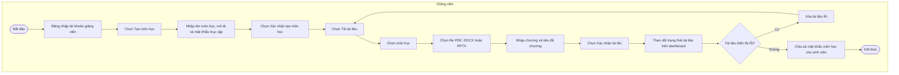
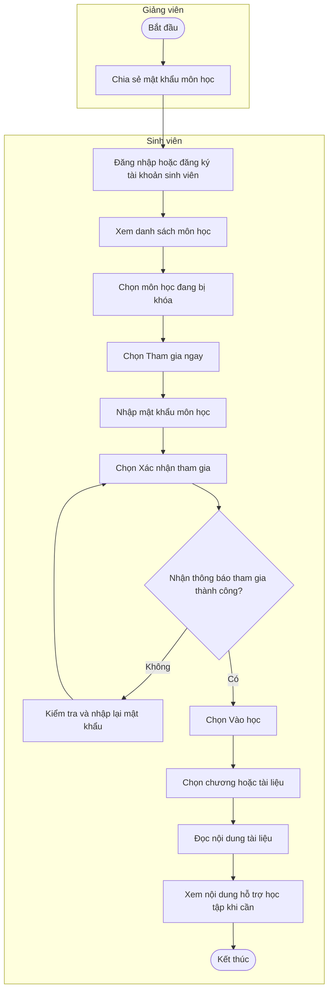
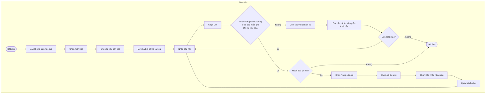

# Swimlane Workflows - Smart RAG Learning Platform

Tài liệu này mô tả 3 workflow nghiệp vụ chính của ứng dụng. Các swimlane chỉ
bao gồm thao tác của con người, không mô tả xử lý nội bộ của hệ thống như API,
database, embedding, cache hoặc AI model.

## Workflow 1: Giảng viên chuẩn bị môn học và tài liệu

**Tác nhân:** Giảng viên

## Workflow 2: Sinh viên tham gia môn học và đọc tài liệu

**Tác nhân:** Giảng viên, Sinh viên

## Workflow 3: Sinh viên hỏi đáp với chatbot theo tài liệu

**Tác nhân:** Sinh viên

**Quy tắc nghiệp vụ:** Mỗi sinh viên được hỏi miễn phí tối đa 5 câu cho từng
tài liệu. Bộ đếm được tính độc lập theo tài liệu. Khi muốn gửi câu thứ 6 trong
cùng một tài liệu, sinh viên phải nâng cấp gói để tiếp tục.

### Ví dụ áp dụng giới hạn câu hỏi

- Sinh viên đã hỏi 5 câu trong tài liệu A thì phải nâng cấp gói để gửi câu thứ
  6 trong tài liệu A.
- Sinh viên vẫn có thể hỏi miễn phí tối đa 5 câu trong tài liệu B.
