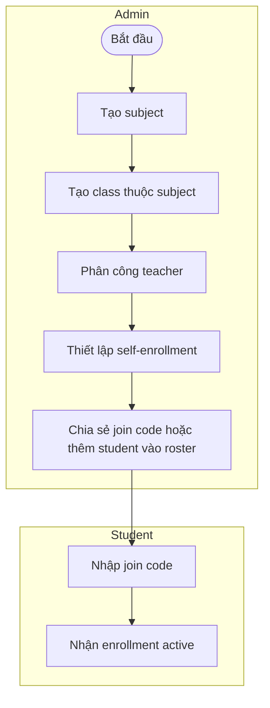
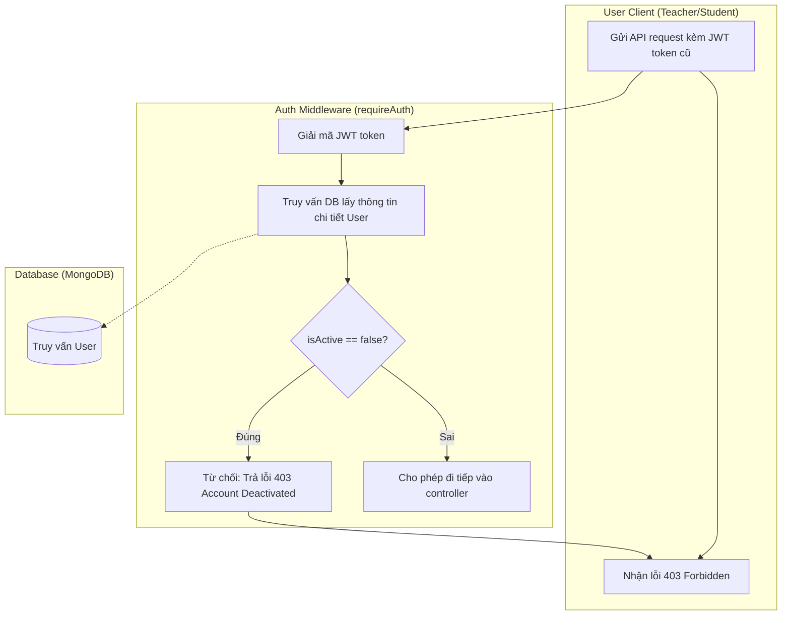

# Swimlane Workflows - Smart RAG Learning Platform

## Workflow 1: Thiết lập môn và lớp



## Workflow 2: Upload, giới hạn phạm vi và duyệt tài liệu


## Workflow 3: Hỏi đáp và quota tháng

Quota tính trên tổng câu hỏi của student trong tháng UTC: Free 50, Plus 300, Pro 1000. Đổi tài liệu, class hoặc subject không tạo quota mới; đổi gói không reset usage.
RAG chỉ dùng chunks của tài liệu đang chọn; nếu không đủ context, hệ thống từ chối trả lời thay vì dùng kiến thức chung.


### Ví dụ quota

- Student Free hỏi 30 câu ở tài liệu A và 20 câu ở tài liệu B thì đã dùng hết 50 câu của tháng.
- Chia một PDF thành nhiều file không tạo thêm lượt hỏi.
- Nâng từ Free lên Plus sau khi đã dùng 50 câu thì còn 250 câu trong tháng đó.

## Workflow 4: Tạo tài khoản mới (Admin)

Quy trình tạo tài khoản của Admin tuân thủ các quy tắc dữ liệu của hệ thống:
- Các trường `username`, `email` và `userCode` phải là duy nhất.
- Khi tạo thành công, tài khoản mặc định có trạng thái `isActive = true`.
- Hệ thống gửi email tự động chứa thông tin đăng nhập (username và password tạm thời) cho người dùng.

```mermaid
flowchart TB
    subgraph Admin_UI["Admin (Frontend)"]
        A[Bắt đầu] --> B[Nhập form: Username, Password, FullName, Email, UserCode, Role]
        B --> C[Gửi HTTP POST /api/admin/users]
        L[Hiển thị lỗi 409/Validation] <-- Lỗi -- K[Nhận kết quả phản hồi]
        M[Hiển thị thành công: 'Đã tạo tài khoản và gửi email' & Tải lại danh sách] <-- Thành công -- K
    end

    subgraph Backend["Backend API (AdminService)"]
        C --> D[Kiểm tra trùng lặp: Username, Email, UserCode]
        D -- Trùng lặp --> E[Ném lỗi 409: Đã tồn tại]
        E --> K
        D -- Hợp lệ --> F[Mã hóa mật khẩu & Tạo User với isActive=true]
        F --> G[Lưu vào Database]
        G --> H[Gọi EmailService gửi thông tin đăng nhập]
        H --> J[Trả về thông tin User mới (không kèm password)]
        J --> K
    end

    subgraph DB["Database (MongoDB)"]
        G -.-> G_DB[(Lưu User record)]
    end

    subgraph Email_Srv["Email Service (SMTP)"]
        H -.-> I[Gửi email thông báo tài khoản mới chứa thông tin đăng nhập]
    end
```

## Workflow 5: Vô hiệu hóa tài khoản (Admin)

Quy trình vô hiệu hóa tài khoản của hệ thống kiểm tra các ràng buộc an toàn nghiêm ngặt:
1. Admin không được tự vô hiệu hóa tài khoản của chính mình.
2. Không được vô hiệu hóa Admin cuối cùng còn hoạt động (`isActive = true`).
3. Khi Teacher bị vô hiệu hóa, mọi Subject Assignment (phân công môn học) đang hoạt động của Teacher phải bị gỡ (`status = 'removed'`) và gửi email thông báo tương ứng.
4. Thu hồi quyền gọi API ngay lập tức thông qua Auth Middleware kiểm tra trường `isActive` của User (ngăn chặn token cũ chưa hết hạn tiếp tục truy cập).

```mermaid
flowchart TB
    subgraph Admin_UI["Admin (Frontend)"]
        A[Bắt đầu] --> B[Chọn User & click 'Vô hiệu hóa']
        B --> C[Gửi HTTP POST /api/admin/users/:id/deactivate]
        L[Hiển thị lỗi: 400/404/409] <-- Thất bại -- K[Nhận kết quả phản hồi]
        M[Hiển thị thành công & Tải lại danh sách] <-- Thành công -- K
    end

    subgraph Backend["Backend API (AdminService)"]
        C --> D{Trùng ID Admin đang thực hiện?}
        D -- Có --> E[Lỗi 400: Không tự vô hiệu hóa chính mình]
        E --> K
        D -- Không --> F{User tồn tại?}
        F -- Không --> G[Lỗi 404: Không tìm thấy User]
        G --> K
        F -- Có --> H{Vai trò là Admin?}
        H -- Có --> I{Số Admin active <= 1?}
        I -- Có --> J[Lỗi 409: Không thể vô hiệu hóa Admin cuối cùng]
        J --> K
        I -- Không --> N[Cập nhật isActive=false & deactivatedAt]
        H -- Không/Khác --> N
        N --> O[Lưu Database]
        
        O --> P{Vai trò là Teacher?}
        P -- Không --> T[Trả về thành công]
        P -- Có --> Q[Cập nhật tất cả Assignment thành 'removed' & removedAt]
        Q --> R[Lưu Database]
        R --> S[Gửi Email thông báo gỡ phân công môn học]
        S --> T
        T --> K
    end

    subgraph DB["Database (MongoDB)"]
        O -.-> O_DB[(Cập nhật User status)]
        R -.-> R_DB[(Cập nhật SubjectAssignments)]
    end

    subgraph Email_Srv["Email Service (SMTP)"]
        S -.-> S_Email[Gửi email gỡ phân công cho Teacher]
    end
```

### Quy trình Thu hồi Quyền gọi API ngay lập tức (Immediate Session Revocation)

Để đảm bảo quy tắc bảo mật *FR-01 #9*, mỗi khi Client gửi request, Auth Middleware sẽ kiểm tra trạng thái hoạt động thực tế trong Database thay vì chỉ giải mã JWT:



