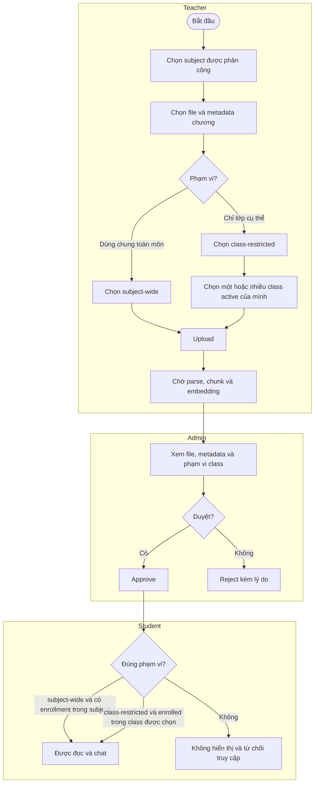
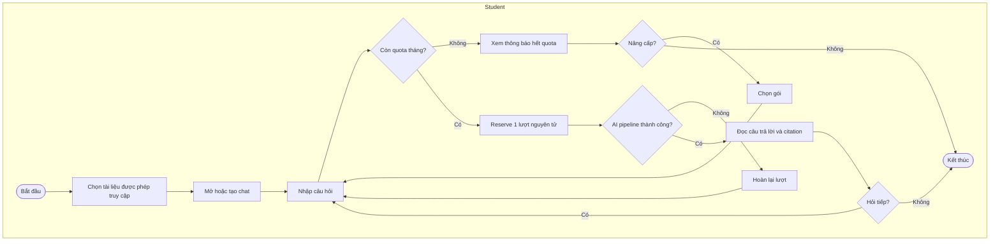

# Swimlane Workflows - Smart RAG Learning Platform

## Workflow 1: Thiết lập môn và lớp

## Workflow 2: Upload, giới hạn phạm vi và duyệt tài liệu

## Workflow 3: Hỏi đáp và quota tháng

Quota tính trên tổng câu hỏi của student trong tháng UTC: Free 50, Plus 300, Pro 1000. Đổi tài liệu, class hoặc subject không tạo quota mới; đổi gói không reset usage.
RAG chỉ dùng chunks của tài liệu đang chọn; nếu không đủ context, hệ thống từ chối trả lời thay vì dùng kiến thức chung.

### Ví dụ quota

- Student Free hỏi 30 câu ở tài liệu A và 20 câu ở tài liệu B thì đã dùng hết 50 câu của tháng.
- Chia một PDF thành nhiều file không tạo thêm lượt hỏi.
- Nâng từ Free lên Plus sau khi đã dùng 50 câu thì còn 250 câu trong tháng đó.
